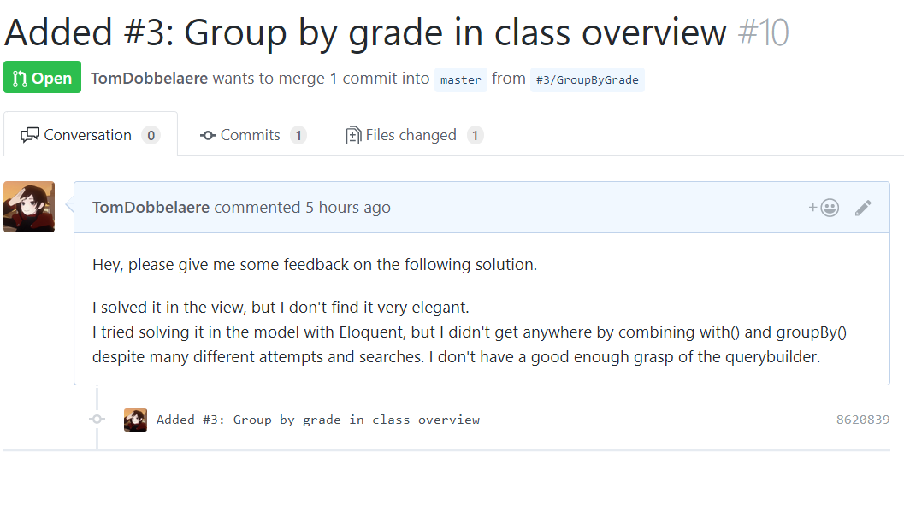

# CMS portfolio Tom Dobbelaere

## Open Source Contribution
Pull request to KUBO, see https://github.com/jacobsyentl/Kubo/pull/10


## How to install
1. Edit `Homestead.yaml` and change `map` under `folders` to this directory.
2. `vagrant up` in this directory and `vagrant ssh`.
3. Create `.env` file in the `portfolio` directory. You can find an example below.
4. Cd to the `portfolio` directory and run `composer install`
5. Run `php artisan key:generate`
6. Connect to the database and use the sql-dump to fill in some dummy data.
7. If you want to create/edit/delete posts, you have to log in using `tom.dobbelaere@outlook.com` with the password `secret`.

Note: Registering was disabled as to provide only admin access. Therefore there's only one account to login with.

## .env file example

```
    APP_NAME=Laravel
    APP_ENV=
    APP_KEY=
    APP_DEBUG=
    APP_LOG_LEVEL=
    APP_URL=
    
    DB_CONNECTION=mysql
    DB_HOST=127.0.0.1
    DB_PORT=3306
    DB_DATABASE=blog
    DB_USERNAME=homestead
    DB_PASSWORD=secret
    
    BROADCAST_DRIVER=log
    CACHE_DRIVER=file
    SESSION_DRIVER=file
    SESSION_LIFETIME=120
    QUEUE_DRIVER=sync
    
    REDIS_HOST=127.0.0.1
    REDIS_PASSWORD=null
    REDIS_PORT=6379
    
    MAIL_DRIVER=smtp
    MAIL_HOST=smtp-mail.outlook.com
    MAIL_PORT=587
    MAIL_USERNAME=
    MAIL_PASSWORD=
    MAIL_ENCRYPTION=tls
    
    PUSHER_APP_ID=
    PUSHER_APP_KEY=
    PUSHER_APP_SECRET=

```
